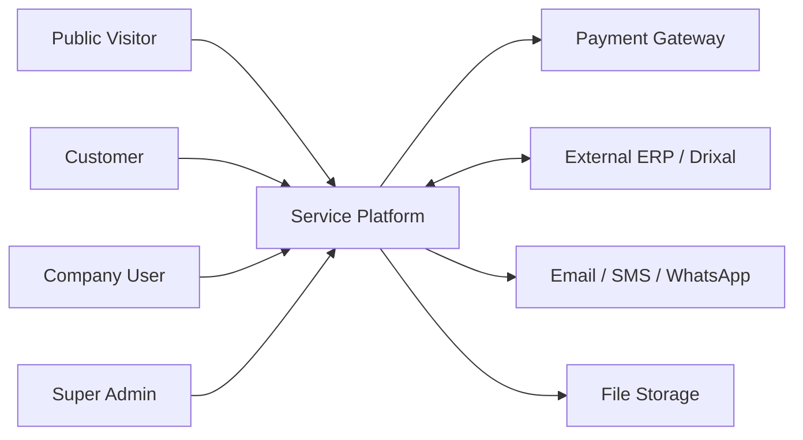
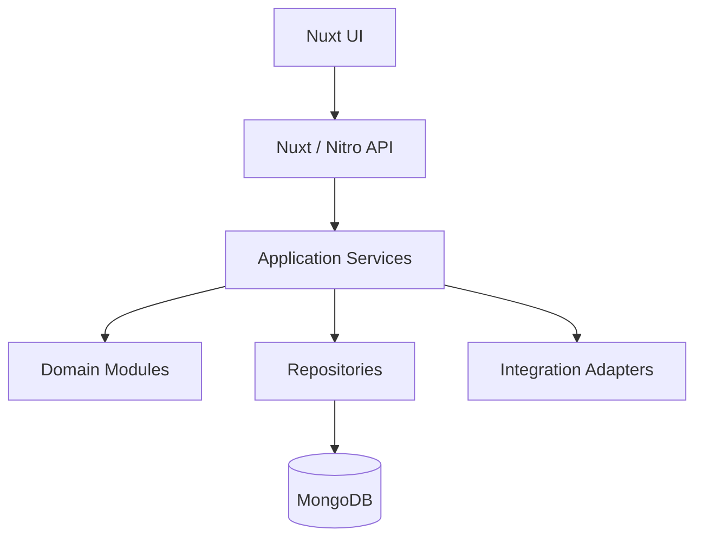
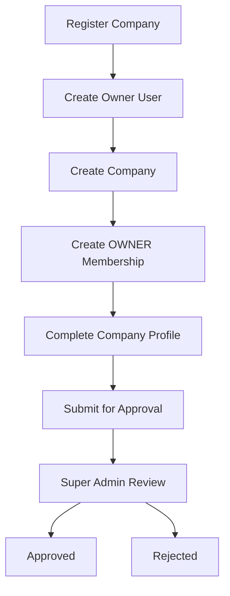
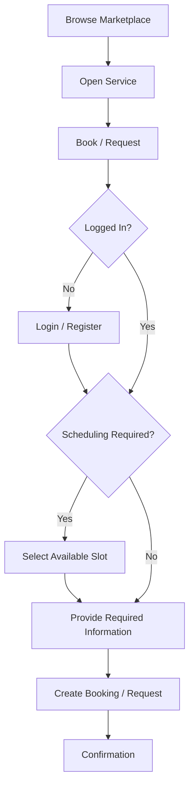
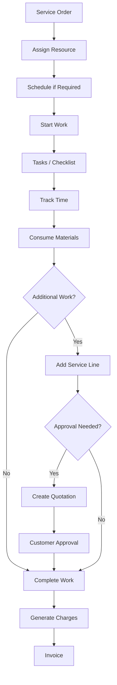

# Drixal Service Platform
## Product, Technical, UX, Testing & Delivery Specification

**Document Role:** Primary implementation context / agent alignment document  
**Status:** Working Specification  
**Architecture:** Standalone-first, integration-ready  
**Application:** Nuxt 4 full-stack application  
**Language:** TypeScript  
**Database:** MongoDB  
**Current Delivery Strategy:** Incremental vertical slices  
**Delivery Status:** Milestones 0-16 implemented (including authentication, RBAC, onboarding, and dashboards); milestones 17-21 planned. Authoritative per-milestone progress is tracked in `docs/milestone-delivery-plan.md`. Sections 86-92 describe the originally planned slice; the implemented scope has expanded beyond them, as reflected in that plan and in the codebase.  

---

# 0. How to Use This Document

This document is the primary source of truth for development.

Any implementation agent should:

1. Read this document before making architectural decisions.
2. Follow the domain boundaries and terminology defined here.
3. Implement only the currently assigned phase/slice.
4. Avoid implementing future features merely because they are described here.
5. Avoid changing core architectural decisions without explicitly documenting the reason.
6. Prefer simple implementations that preserve future extensibility.
7. Never add industry-specific service behavior when the same requirement can be represented as a generic capability.
8. Keep the platform functional without Drixal ERP.
9. Treat Drixal ERP as an optional integration target.
10. Preserve tenant/company isolation on every business operation.

When this document conflicts with exploratory prototypes, this document wins unless the product owner explicitly changes the decision.

---

# 1. Product Summary

The product is a **multi-tenant Service Platform** that allows service providers to:

- Register their companies.
- Configure their organizations.
- Publish services.
- Receive customer bookings and requests.
- Execute services.
- Manage customers.
- Manage schedules and resources.
- Issue quotations.
- Issue invoices.
- Receive payments.
- Receive reviews.
- Track operational and financial activity.

Customers can:

- Browse the public marketplace.
- Discover service providers.
- Search and filter services.
- Register when interaction is required.
- Book/request services.
- Track service activity.
- Receive quotations.
- Pay invoices.
- Receive notifications.
- Review completed services.

Super Admins manage:

- Companies.
- Company approvals.
- Service categories.
- Subscription plans.
- Platform activity.
- Platform-level statistics.
- Notifications and operational issues.

The official supplied requirements explicitly require company onboarding and approval, a public marketplace, public company/service pages, customer accounts, customer/company/admin dashboards, subscriptions, payments, reviews, publishing, notifications, search/filtering, and booking lifecycle management.

---

# 2. Core Product Principle

The product must support different service industries without requiring a different application architecture for each industry.

Do NOT model:

```text
CAR_REPAIR_SERVICE
SALON_SERVICE
CLINIC_SERVICE
IT_SUPPORT_SERVICE
```

Instead:

> A service is composed from configurable capabilities.

Examples of capabilities:

```text
Scheduling
Location
Duration
Resources
Customer Assets
Tasks
Checklists
Time Tracking
Materials
Pricing
Approval
Recurrence
```

Example:

```text
AC Maintenance

Scheduling: Required
Location: Customer Location
Asset: Required
Resource: Technician
Materials: Allowed
Checklist: Required
Pricing: Time & Materials
```

Example:

```text
Legal Consultation

Scheduling: Optional
Location: Remote / Provider
Asset: None
Resource: Lawyer
Time Tracking: Required
Pricing: Hourly
```

---

# 3. Architecture Principle

## Standalone First — Integration Ready

The platform must operate completely without Drixal ERP.

Standalone:

```text
Customer
   ↓
Service Platform
   ↓
Service Execution
   ↓
Invoice
   ↓
Payment
```

Integrated deployment:

```text
Service Platform
       ↓
Integration Layer
       ↓
Drixal ERP
```

Drixal ERP must be an integration target, not a runtime dependency.

Avoid putting fields such as:

```text
drixalCustomerId
drixalInvoiceId
drixalServiceId
```

throughout the domain.

Use generic external mapping instead:

```text
ExternalReference

provider
entityType
localEntityId
externalEntityId
```

Example:

```text
provider = DRIXAL
entityType = CUSTOMER
localEntityId = ...
externalEntityId = ...
```

---

# 4. System Context



---

# 5. Main Product Modules

```text
Platform
│
├── Identity & Authentication
├── Companies & Multi-Tenancy
├── Company Memberships & RBAC
├── Company Approval
│
├── Platform Categories
├── Service Catalog
├── Service Publishing
│
├── Marketplace
├── Marketplace Search
├── Company Profiles
│
├── Customers
├── Service Requests
├── Bookings
│
├── Service Orders
├── Scheduling
├── Resources
├── Customer Assets
├── Service Execution
│
├── Quotations
├── Invoices
├── Payments
│
├── Reviews & Ratings
├── Notifications
│
├── Company Subscriptions
│
├── Customer Dashboard
├── Company Dashboard
├── Super Admin Dashboard
│
└── External Integrations
```

These are domain boundaries.

They do **not** mean each module must be a microservice.

---

# 6. Target Architecture

Use a modular monolith.



Do NOT create microservices for the initial product.

---

# 7. Suggested Technology Stack

## Application

```text
Nuxt 4
Vue 3
TypeScript
Nitro
```

## Database

```text
MongoDB
```

## UI

Use the existing Drixal design conventions where available.

For the standalone project, use one consistent UI system rather than mixing component libraries.

Possible stack:

```text
Tailwind CSS
Nuxt UI
```

if no existing standard was supplied.

## Validation

Use one consistent server-side validation library.

Examples:

```text
Zod
Valibot
```

Do not rely only on client validation.

---

# 8. Identity Model

There is one global:

```text
User
```

Do NOT create separate:

```text
CustomerUser
CompanyUser
TechnicianUser
```

A single person may simultaneously be:

```text
Customer of Company A
Technician at Company B
Owner of Company C
```

Identity describes the person.

Relationships determine context and authorization.

---

# 9. Company Membership

Company roles belong to the relationship between User and Company.

Use:

```text
CompanyMembership
```

Conceptually:

```text
userId
companyId

role
status

joinedAt
invitedBy
```

Example roles:

```text
OWNER
ADMIN
SERVICE_MANAGER
AGENT
TECHNICIAN
FINANCE
```

Do NOT store one global:

```text
user.role
```

for company authorization.

---

# 10. Customer vs Company Membership

Being a customer does NOT mean belonging to a provider company.

Therefore:

```text
CUSTOMER
```

must not simply be another `CompanyMembership.role`.

A customer interacts with a company through:

```text
Request
Booking
Service Order
Invoice
Payment
Review
```

Company customer-management capabilities can maintain a company-specific customer relationship/profile when necessary.

Provider customer management is explicitly required.

---

# 11. Multi-Tenancy

A service-provider Company acts as a tenant.

Most business documents must carry:

```text
companyId
```

Examples:

```text
Service
Booking
ServiceRequest
ServiceOrder
Resource
CustomerAsset
Invoice
Payment
Review
```

Every backend query must enforce company boundaries.

Never trust:

```text
companyId
```

sent from the browser without authorization verification.

---

# 12. Company Registration Flow



The registration process should behave as one logical application operation where possible.

Avoid leaving:

```text
Company without Owner
Owner without Membership
```

because one write failed.

Company registration and approval are explicit requirements.

---

# 13. Company Status

Suggested lifecycle:

```text
PENDING_APPROVAL
APPROVED
REJECTED
SUSPENDED
```

Possible transitions:

```text
PENDING_APPROVAL → APPROVED

PENDING_APPROVAL → REJECTED

APPROVED → SUSPENDED

SUSPENDED → APPROVED
```

Company status is different from CompanyMembership status.

---

# 14. Platform Categories

Service categories are globally controlled by Super Admin.

Examples:

```text
Automotive
Home Services
IT Services
Healthcare
Professional Services
Beauty & Personal Care
```

Companies choose categories when defining services.

Platform-level service categories are explicitly required.

---

# 15. Service Definition

A Service Definition represents something a company offers.

Examples:

```text
AC Maintenance
Haircut
Laptop Repair
Legal Consultation
Home Cleaning
```

Typical fields:

```text
companyId
categoryId

name
slug
description

pricing

duration

locationType

scheduling

capabilities

operationalStatus
publicationStatus

createdAt
updatedAt
```

---

# 16. Service Operational Status vs Publication Status

These are separate concepts.

## Operational status

Whether the company currently offers the service internally:

```text
ACTIVE
INACTIVE
```

## Publication status

Whether the service can appear publicly:

```text
DRAFT
PENDING_REVIEW
PUBLISHED
UNPUBLISHED
SUSPENDED
ARCHIVED
```

The supplied requirement explicitly separates service activation/deactivation and marketplace publishing and expects publication statuses.

Initial implementation may simplify this to:

```text
DRAFT
PUBLISHED
UNPUBLISHED
```

---

# 17. Public Marketplace

Visitors must be able to use the marketplace without authentication.

Public marketplace includes:

```text
Published Companies
Published Services
Company Profiles
Service Details
Search
Filters
```

Public browsing without authentication is explicitly required.

Only eligible content should appear:

```text
Company.status = APPROVED

AND

Service.publicationStatus = PUBLISHED

AND

Service.operationalStatus = ACTIVE
```

---

# 18. Public Company Profile

Suggested route:

```text
/marketplace/companies/:slug
```

Show:

```text
Company Name
Description
Categories
Locations
Published Services
Average Rating
Review Count
Availability summary where applicable
```

The supplied requirements explicitly expect company information, categories, services, locations, ratings and applicable availability.

---

# 19. Public Service Details

Suggested route:

```text
/marketplace/services/:slug
```

Show:

```text
Service Name
Company
Category
Description
Pricing
Duration
Location Type
Availability
Requirements
Rating
Booking / Request action
```

These details are explicitly required.

---

# 20. Marketplace Search

Required filters eventually include:

```text
Category
Service
Company
Location
Price
Availability
Rating
Supported Services
```

These filters are explicitly required.

Use server-side filtering.

Example:

```text
/marketplace
?search=ac
&category=home-services
&city=Alexandria
&minPrice=100
&maxPrice=1000
```

Keep filter state in URL query parameters.

Benefits:

```text
Shareable
Refresh-safe
Back-button friendly
SEO-friendly
```

---

# 21. Request vs Booking vs Service Order

These are different domain concepts.

## Service Request

Customer knows the problem/need but not necessarily the exact service.

Example:

```text
"My laptop keeps shutting down."
```

## Booking

Customer selects a known service and usually selects a schedule.

Example:

```text
AC Maintenance
Monday
10:00 AM
```

## Service Order

Actual work being executed.

Possible flows:

```text
Request
   ↓
Service Order
```

or:

```text
Booking
   ↓
Service Order
```

or internally:

```text
Service Order
```

without a marketplace request.

---

# 22. Customer Marketplace Booking Flow



Authentication is required when the customer begins transactional interaction with a provider.

---

# 23. Booking Lifecycle

Target lifecycle:

```text
REQUESTED
CONFIRMED
RESCHEDULED
IN_PROGRESS
COMPLETED
CANCELLED
NO_SHOW
```

Payment and review are related downstream concepts rather than necessarily booking statuses.

Conceptually:

```text
Request / Booking
        ↓
Confirmation
        ↓
Scheduling / Rescheduling
        ↓
Execution
        ↓
Completion
        ↓
Payment
        ↓
Review
```

This end-to-end lifecycle is explicitly required.

---

# 24. Service Order

The Service Order is the central execution container.

Conceptual structure:

```text
ServiceOrder
│
├── Customer
├── ServiceOrderLines
├── Assets
├── Appointments
├── Resource Assignments
├── Tasks
├── Checklists
├── Time Entries
├── Material Usage
├── Attachments
├── Charges
├── Quotations
└── Invoice References
```

---

# 25. Service Order Lines

One Service Order may contain multiple services.

Example:

```text
Car Repair Order

- Diagnosis
- Oil Change
- Brake Repair
- Brake Pads Replacement
```

A line may reference a catalog service.

It may also be ad-hoc.

Example:

```text
Broken wiring repair
```

discovered during execution.

Therefore:

```text
serviceDefinitionId
```

must not necessarily be mandatory.

---

# 26. Service Execution Flow



---

# 27. Scheduling

Scheduling must be optional.

A service may support:

```text
NONE
OPTIONAL
REQUIRED
```

A Service Order may have:

```text
0..N Appointments
```

Required scheduling operations:

```text
Schedule
Confirm
Reschedule
Cancel
Start
Complete
No-show
```

Resource conflict detection must be server-side.

---

# 28. Resources

Resources must not be limited to employees.

Possible future resource types:

```text
EMPLOYEE
TEAM
FACILITY
ROOM
EQUIPMENT
VEHICLE
```

Examples:

```text
Clinic:
Doctor + Room

Training:
Instructor + Training Room

Photography:
Photographer + Studio + Camera Kit

Moving:
Crew + Truck
```

---

# 29. Customer Assets

Services may be executed against assets such as:

```text
Car
Laptop
Air Conditioner
Server
Elevator
Machine
Property
```

A Service Order may reference:

```text
0 assets
1 asset
many assets
```

An individual Service Order Line may reference a specific asset.

---

# 30. Tasks & Checklists

Tasks answer:

> What must be done?

Example:

```text
Inspect Filter
Clean Unit
Test Cooling
```

Checklists answer:

> What information must be verified or recorded?

Example:

```text
Pressure: 120 PSI
Leak detected: No
Condition: Good
```

Initial checklist field types:

```text
BOOLEAN
TEXT
NUMBER
SELECT
```

---

# 31. Time Tracking

Time Entry concept:

```text
serviceOrderId
serviceOrderLineId?
resourceId

start
end
duration

description
billable
```

Used for:

```text
Execution history
Hourly pricing
Costing
Utilization
Reporting
```

---

# 32. Material Usage

Material consumption should eventually represent inventory consumed during service execution.

Example:

```text
Brake Pads ×1
Engine Oil ×4
Filter ×1
```

Do not deeply couple the domain to Drixal inventory.

Use an inventory abstraction/integration boundary where required.

---

# 33. Pricing

Initial pricing strategies:

```text
FIXED
HOURLY
QUANTITY
TIME_AND_MATERIAL
CUSTOM_QUOTE
```

Future strategies may include:

```text
DISTANCE
AREA
PER_PARTICIPANT
MILESTONE
SUBSCRIPTION
TIERED
```

Do not use:

```text
service.price
```

as the complete pricing architecture.

---

# 34. Quotations

Typical flow:

```text
Diagnosis
    ↓
Estimated Work
    ↓
Quotation
    ↓
Customer Approval
    ↓
Execution
```

Quotation should preserve the commercial terms that were presented to the customer.

---

# 35. Invoice & Payment Separation

Invoice and Payment are separate entities.

The supplied specification explicitly requires this separation.

Example:

```text
Invoice Total:
5000

Payment 1:
2000

Payment 2:
1500

Total Paid:
3500

Outstanding:
1500

Invoice Status:
PARTIALLY_PAID
```

Suggested invoice payment states:

```text
UNPAID
PARTIALLY_PAID
PAID
```

---

# 36. Payment Domain

Two different payment contexts exist.

## Customer → Company

Payment for service invoices.

## Company → Platform

Payment for company subscriptions.

Company subscription payment tracking is explicitly required.

Do not design Payment only around Service Orders.

---

# 37. Payment Gateway Architecture

Use:

```text
PaymentService
      ↓
PaymentGateway Interface
      ↓
Provider Adapter
```

Example:

```text
PaymentGateway
├── ProviderAAdapter
├── ProviderBAdapter
└── FutureGatewayAdapter
```

The supplied specification explicitly requires gateway abstraction.

Provider-specific API logic must remain outside the Payment domain.

---

# 38. Reviews & Ratings

Customers should only review eligible completed interactions.

Possible rule:

```text
Booking / Service Order completed

AND

customer owns interaction

AND

review does not already exist
```

Support:

```text
Rating
Review text
Service reference
Company reference
Customer reference
Created at
```

Review/rating support is explicitly required.

---

# 39. Company Subscriptions

Company subscriptions are subscriptions to use the **platform**.

They are not customer service subscriptions.

Model separately:

```text
SubscriptionPlan
CompanySubscription
SubscriptionPayment
```

Plan may contain:

```text
Name
Price
Features
Limits
Billing Period
Status
```

Subscription may contain:

```text
companyId
planId

status

startDate
endDate

renewal
```

Company plan creation/management and subscription tracking are explicit requirements.

---

# 40. Notifications

Notifications are a platform domain, not a small UI helper.

Required recipient groups:

```text
Customers
Company Users
Super Admin
```

Required event examples are described in the supplied specification.

Use event-driven behavior:

```text
Domain Event
      ↓
Notification Handler
      ↓
Notification Record
      ↓
Delivery Channel
```

---

# 41. Notification Model

Conceptually:

```text
recipientUserId

companyId?

eventType

title
message

priority

readAt?

metadata

createdAt
```

Notification center must support:

```text
Read / Unread
Recipient
Event Type
Timestamp
Priority
Preferences
```

These requirements are explicitly specified.

---

# 42. Notification Event Examples

Customer:

```text
registration.completed
booking.confirmed
booking.rescheduled
booking.cancelled
quotation.created
quotation.approved
service.completed
payment.completed
```

Company:

```text
booking.created
service.request.created
payment.received
review.created
subscription.expiring
company.approved
```

Super Admin:

```text
company.registration.submitted
company.approval.requested
subscription.payment.failed
platform.payment.issue
```

---

# 43. Dashboard Architecture

There are three distinct dashboards.

The supplied requirements explicitly define customer, company and Super Admin dashboards.

---

# 44. Customer Dashboard

Include:

```text
Upcoming Bookings
Service Requests
Service History
Invoices
Outstanding Balance
Payment History
Notifications
Profile
```

UX priority:

> Tell the customer what is happening with their services and what action is required.

---

# 45. Company Dashboard

Include:

```text
Open Requests
Upcoming Bookings
Orders In Progress
Orders Requiring Attention
Customers
Revenue
Payments
Resources
Reviews
Subscription Status
```

Main questions it should answer:

```text
What requires attention?

What is happening today?

What is overdue?

Who is assigned?

What needs approval?

What was earned?
```

---

# 46. Super Admin Dashboard

Include platform KPIs:

```text
Companies
Pending Companies
Users
Published Services
Bookings
Requests
Payments
Revenue
Subscriptions
Platform Activity
```

Super Admin statistics/filtering are explicitly required. 
---

# 47. MongoDB Modeling Strategy

Do NOT interpret MongoDB as:

> Embed everything.

Use a hybrid strategy.

## Embed when:

- Child data is small.
- Child data belongs entirely to parent.
- Child data is normally read with parent.
- Child data does not grow indefinitely.
- Independent querying is uncommon.

Example:

```text
Service Snapshot
Pricing Snapshot
Small Configuration Objects
```

## Reference/separate collection when:

- Data grows independently.
- Independent querying is common.
- Independent lifecycle exists.
- Pagination is required.
- Frequent concurrent writes occur.
- Many entities reference it.

Examples:

```text
Users
Companies
Memberships
Services
Bookings
Orders
Appointments
Payments
Notifications
```

---

# 48. Candidate MongoDB Collections

Target project may eventually contain:

```text
users

companies
company_memberships

service_categories
services

company_customers

service_requests
bookings

service_orders
service_order_lines

appointments
resources
customer_assets

service_tasks
checklist_instances
time_entries
material_usage

quotations
invoices
payments

reviews

notifications
notification_preferences

subscription_plans
company_subscriptions

external_references
```

Do not create every collection before its phase is implemented.

---

# 49. Core Mongo Indexing Principle

Most tenant operational indexes should begin with:

```text
companyId
```

Examples:

```text
{ companyId: 1, status: 1 }

{ companyId: 1, customerId: 1 }

{ companyId: 1, createdAt: -1 }

{ companyId: 1, assignedResourceId: 1 }
```

Marketplace indexes differ because queries are public/platform-wide.

Likely indexes include:

```text
publicationStatus
categoryId
companyId
location
price
```

Index only according to real query patterns.

---

# 50. API Principles

Prefer:

```text
Resource endpoints
+
Explicit command endpoints
```

Example CRUD:

```text
GET    /api/services
POST   /api/services
GET    /api/services/:id
PATCH  /api/services/:id
```

Commands:

```text
POST /api/services/:id/publish

POST /api/bookings/:id/confirm

POST /api/service-orders/:id/start

POST /api/service-orders/:id/complete

POST /api/quotations/:id/approve
```

Avoid generic endpoints such as:

```text
POST /api/entity/change-status
```

with unrestricted arbitrary status transitions.

---

# 51. Search & Filtering API

Use server-side queries.

Example:

```text
GET /api/marketplace/services
?search=ac
&category=home-services
&city=Alexandria
&minPrice=100
&maxPrice=1000
&page=1
&limit=20
```

Internal example:

```text
GET /api/service-orders
?status=IN_PROGRESS
&priority=HIGH
&resourceId=...
&from=...
&to=...
&page=1
```

Do not load entire company datasets into Nuxt and filter them client-side.

---

# 52. Suggested Nuxt Structure

```text
app/
│
├── pages/
│   ├── marketplace/
│   ├── customer/
│   ├── provider/
│   └── admin/
│
├── components/
│   ├── common/
│   ├── marketplace/
│   ├── services/
│   ├── bookings/
│   ├── service-orders/
│   └── dashboards/
│
├── composables/
│
└── types/

server/
│
├── api/
│
├── modules/
│   ├── identity/
│   ├── companies/
│   ├── services/
│   ├── marketplace/
│   ├── bookings/
│   ├── service-orders/
│   ├── commerce/
│   ├── notifications/
│   └── subscriptions/
│
├── repositories/
│
├── integrations/
│
└── utils/
```

Do not force this exact structure if a simpler structure is sufficient during early implementation.

The boundary matters more than folder ceremony.

---

# 53. UI/UX Principles

## 53.1 Always Design Around User Intent

Every page should answer one main question.

Marketplace:

> What service should I choose?

Provider dashboard:

> What needs my attention?

Technician work page:

> What work do I need to perform?

Customer dashboard:

> What is happening with my service?

Super Admin:

> What requires platform-level intervention?

---

# 54. Navigation

Use separate navigation contexts.

## Public

```text
Marketplace
Categories
Companies
Login
Register
```

## Customer

```text
Overview
Bookings
Requests
Service History
Invoices & Payments
Notifications
Profile
```

## Provider

```text
Dashboard
Services
Bookings
Requests
Orders
Customers
Schedule
Resources
Payments
Reviews
Company Settings
Subscription
```

## Super Admin

```text
Dashboard
Companies
Categories
Users
Services
Subscriptions
Payments
Platform Activity
```

Do not expose navigation items the current role cannot use.

---

# 55. Forms

Every form should:

- Have visible labels.
- Clearly identify required fields.
- Show field-level errors.
- Preserve valid data when another field fails.
- Disable duplicate submissions while processing.
- Provide meaningful server error messages.
- Group related fields.
- Avoid huge single-page forms when onboarding is complex.

Company onboarding should preferably use steps.

Example:

```text
Account
  ↓
Company Information
  ↓
Locations
  ↓
Business Information
  ↓
Review
  ↓
Submit
```

---

# 56. Lists & Tables

Operational lists should support:

```text
Search
Filters
Sorting
Pagination
Clear Filters
Loading State
Empty State
Error State
```

Useful filters should remain visible.

Avoid putting every filter inside a hidden modal.

---

# 57. URL State

Important list/search state should be represented in URL query parameters.

Example:

```text
/provider/orders?status=IN_PROGRESS&priority=HIGH
```

Benefits:

- Back navigation.
- Refresh.
- Sharing.
- Dashboard deep-links.

---

# 58. Status Design

Statuses should use:

- Consistent badges.
- Human-readable labels.
- Predictable colors.
- Tooltips/descriptions when ambiguous.

Do not use color alone to communicate status.

Example:

```text
Published
Draft
Awaiting Approval
In Progress
Completed
Cancelled
```

---

# 59. Empty States

Do not display:

```text
No data.
```

Prefer actionable empty states.

Example:

```text
You haven't created any services yet.

Create your first service to start accepting customer requests.

[Create Service]
```

---

# 60. Loading States

Use appropriate:

```text
Skeletons
Button loading indicators
Inline spinners
```

Avoid full-page blocking loaders for small actions.

---

# 61. Error States

Errors should explain:

1. What happened.
2. What the user can do.

Bad:

```text
Error 500
```

Better:

```text
We couldn't publish this service.

Check that the company is approved and required service information is complete.
```

---

# 62. Destructive Actions

Actions such as:

```text
Delete
Cancel
Suspend
Reject
Archive
```

must require deliberate confirmation when they have significant consequences.

Confirmation copy must identify the affected entity.

---

# 63. Responsive Design

The platform should work on:

```text
Desktop
Tablet
Mobile
```

Priority mobile flows:

```text
Marketplace browsing
Booking
Customer dashboard
Technician assigned work
Notifications
```

Large operational admin tables may use responsive card/list alternatives on narrow screens.

---

# 64. Accessibility

Minimum expectations:

- Keyboard navigation.
- Semantic labels.
- Visible focus states.
- Adequate contrast.
- Form error associations.
- Buttons must use actual button elements.
- Links must use links.
- Icon-only controls need accessible labels.
- Color must not be the only status signal.

---

# 65. UX for Search

Search should:

- Debounce text input when querying server.
- Preserve filters while searching.
- Show result count.
- Provide Clear Filters.
- Show applied filter chips where useful.
- Handle zero results gracefully.

Avoid API request on every keystroke without debounce.

---

# 66. UX for Booking

Booking UI should only request fields relevant to the selected service.

Example:

If:

```text
scheduling.required = false
```

do not show appointment-selection UI.

If:

```text
asset.required = true
```

request/select customer asset.

This is where service capabilities should directly influence UX.

---

# 67. UX for Service Configuration

Do not overwhelm the provider with every future capability.

Use progressive configuration.

Example:

```text
Basic Info
Pricing
Availability / Scheduling
Execution Requirements
Marketplace
```

Only show relevant configuration based on enabled capabilities.

---

# 68. Security Requirements

Every protected endpoint must check:

```text
Authentication

Tenant membership

Role / permission

Entity ownership
```

Never rely on frontend hiding buttons.

Examples that must fail server-side:

```text
Company A reading Company B orders.

Technician changing company subscription.

Customer editing another customer's booking.

Unapproved company publishing marketplace services.
```

---

# 69. Authorization Principle

Authorization is contextual.

Example:

```text
User X

OWNER in Company A
TECHNICIAN in Company B
```

The authorization decision must consider:

```text
userId
+
companyId
+
membership
+
permission
```

---

# 70. Audit Requirements

Audit significant actions:

```text
Company approved
Company suspended

Service published
Service unpublished

Booking rescheduled
Booking cancelled

Order assigned
Order completed

Quotation approved

Invoice issued
Payment recorded

Subscription changed
```

Capture at least:

```text
Actor
Action
Entity
Entity ID
Timestamp
Relevant metadata
```

---

# 71. Testing Strategy

Testing occurs at several levels.

```text
Unit
Integration
API
Authorization
Tenant Isolation
E2E
UI/UX
Performance
```

---

# 72. General Test Checklist

## API

- [ ] Valid input succeeds.
- [ ] Invalid input returns proper validation error.
- [ ] Missing required fields fail.
- [ ] Unknown IDs return appropriate not-found result.
- [ ] Duplicate submissions are handled.
- [ ] Unauthorized requests fail.
- [ ] Forbidden requests fail.
- [ ] Cross-tenant access fails.
- [ ] Pagination works.
- [ ] Filtering works.
- [ ] Sorting works.
- [ ] Search works.

---

# 73. Company Tests

- [ ] Company registration creates expected records.
- [ ] Owner relationship is created.
- [ ] Company begins in correct approval state.
- [ ] Super Admin can approve company.
- [ ] Super Admin can reject company.
- [ ] Approved company can operate.
- [ ] Suspended company loses restricted capabilities.
- [ ] Company A cannot access Company B data.
- [ ] Membership role changes affect authorization.

---

# 74. Service Catalog Tests

- [ ] Company can create service.
- [ ] Service belongs to correct company.
- [ ] Service starts as Draft where applicable.
- [ ] Service can be edited.
- [ ] Company cannot modify another company's service.
- [ ] Required service information is validated.
- [ ] Pricing configuration is validated.
- [ ] Unsupported capability combinations fail appropriately.

---

# 75. Publication Tests

- [ ] Draft service does not appear publicly.
- [ ] Published service appears publicly.
- [ ] Unpublished service disappears publicly.
- [ ] Suspended service does not appear.
- [ ] Inactive service does not appear where applicable.
- [ ] Unapproved company cannot publish publicly.
- [ ] Suspended company services do not appear.
- [ ] Public details endpoint hides non-public services.

---

# 76. Marketplace Tests

- [ ] Marketplace works without authentication.
- [ ] Search by service name works.
- [ ] Category filter works.
- [ ] Company filter works.
- [ ] Location filter works.
- [ ] Price filter works.
- [ ] Rating filter works when implemented.
- [ ] Availability filter works when implemented.
- [ ] Combined filters work.
- [ ] Pagination works.
- [ ] Empty result state is correct.
- [ ] Invalid filters are handled gracefully.
- [ ] Hidden/unpublished services never leak.

---

# 77. Authentication Tests

- [ ] Public browsing requires no login.
- [ ] Booking action requires login.
- [ ] Service request requires login.
- [ ] Customer dashboard requires login.
- [ ] Provider dashboard requires company membership.
- [ ] Admin dashboard requires Super Admin permission.
- [ ] Invalid/expired sessions are rejected.

---

# 78. Booking Tests

- [ ] Scheduled service allows slot selection.
- [ ] Non-scheduled service does not require slot.
- [ ] Required customer fields are validated.
- [ ] Booking belongs to correct customer/company.
- [ ] Customer can view own booking.
- [ ] Other customer cannot view booking.
- [ ] Provider can view company booking.
- [ ] Confirm transition works.
- [ ] Reschedule works.
- [ ] Cancellation works.
- [ ] No-show works.
- [ ] Invalid status transitions fail.
- [ ] Double booking is prevented where required.

---

# 79. Service Order Tests

- [ ] Order can be created from booking.
- [ ] Order can be created from request.
- [ ] Internal order can be created where allowed.
- [ ] Multiple service lines work.
- [ ] Ad-hoc service line works.
- [ ] Assigned technician can access order.
- [ ] Unauthorized technician cannot access order.
- [ ] Required tasks block completion.
- [ ] Required checklist blocks completion.
- [ ] Time entries work.
- [ ] Material usage works.
- [ ] Completion transition works.
- [ ] Invalid transitions fail.

---

# 80. Payment Tests

- [ ] Invoice and Payment remain separate.
- [ ] Full payment marks invoice Paid.
- [ ] Partial payment marks invoice Partially Paid.
- [ ] Outstanding balance calculation is correct.
- [ ] Multiple payments are supported.
- [ ] Payment history is retained.
- [ ] Duplicate gateway callbacks do not create duplicate payments.
- [ ] Failed payment does not mark invoice paid.
- [ ] Customer cannot view another customer's payment.
- [ ] Company can only view authorized payments.

---

# 81. Notification Tests

- [ ] Correct event creates notification.
- [ ] Correct recipient receives notification.
- [ ] Wrong tenant never receives notification.
- [ ] Read/unread works.
- [ ] Notification preference is respected.
- [ ] Duplicate event processing is safe where necessary.
- [ ] Notification click navigates to correct entity.
- [ ] Customer/company/admin event audiences are correct.

---

# 82. Review Tests

- [ ] Completed eligible service can be reviewed.
- [ ] Incomplete service cannot be reviewed.
- [ ] Customer cannot review someone else's service.
- [ ] Duplicate reviews obey configured rule.
- [ ] Rating aggregate updates correctly.
- [ ] Suspended/removed review handling is consistent.

---

# 83. Subscription Tests

- [ ] Admin can create plan.
- [ ] Company can subscribe.
- [ ] Plan status is tracked.
- [ ] Subscription start/end dates work.
- [ ] Renewal behavior works.
- [ ] Company subscription payment is recorded separately.
- [ ] Subscription payment history is available.
- [ ] Plan limits are enforced where implemented.

---

# 84. UI/UX Test Checklist

- [ ] Every page has loading state.
- [ ] Every list has empty state.
- [ ] API errors are visible to user.
- [ ] Forms show field errors.
- [ ] Buttons prevent duplicate submission.
- [ ] Destructive actions require confirmation.
- [ ] Important filters persist in URL.
- [ ] Pages work on mobile.
- [ ] Keyboard navigation works.
- [ ] Focus styles are visible.
- [ ] Status does not depend on color alone.
- [ ] No inaccessible icon-only controls.
- [ ] Tables remain usable on smaller screens.
- [ ] User sees only actions they are allowed to perform.

---

# 85. Performance Checklist

- [ ] Lists use server-side pagination.
- [ ] Large arrays are not loaded unnecessarily.
- [ ] Mongo queries use appropriate indexes.
- [ ] No obvious N+1 query pattern.
- [ ] Marketplace search is debounced.
- [ ] Dashboard avoids excessive independent API requests.
- [ ] Attachments are not stored directly as huge Mongo documents.
- [ ] High-volume collections have index strategy.
- [ ] Query plans are reviewed once realistic data volume exists.

---

# 86. Current Delivery Slice

The immediate implementation is deliberately smaller than the full platform.

## Goal

Demonstrate:

```text
Company
   ↓
Create Service
   ↓
Draft
   ↓
Publish
   ↓
Public Marketplace
   ↓
Search / Filter
   ↓
Service Details
```

This demonstrates both provider and marketplace behavior.

---

# 87. Current Slice Scope

The current implemented slice has expanded beyond the original foundation to include:

```text
companies

service_categories

services

service_requests

customers

service_orders

users

company_memberships

sessions
```

Authentication is implemented (Argon2id passwords, HTTP-only sessions, contextual company memberships) and is no longer deferred from this slice.

Temporary seeded company data is acceptable.

Authoritative milestone progress lives in `docs/milestone-delivery-plan.md`. Notifications, payments and invoices, reviews, company subscriptions, and external ERP integrations remain planned, not implemented.

This is a delivery shortcut, not the final architecture.

---

# 88. Current Company Model

Conceptual:

```text
{
  _id,

  name,
  slug,
  description,

  status:
    PENDING |
    APPROVED |
    SUSPENDED,

  location: {
    city,
    area
  },

  rating,

  createdAt,
  updatedAt
}
```

Use approved demo companies.

---

# 89. Current Category Model

```text
{
  _id,

  name,
  slug,

  isActive,

  createdAt,
  updatedAt
}
```

Seed:

```text
Automotive
Home Services
IT Services
Professional Services
Healthcare
Beauty & Personal Care
```

---

# 90. Current Service Model

```text
{
  _id,

  companyId,
  categoryId,

  name,
  slug,
  description,

  pricing: {
    type:
      FIXED |
      HOURLY |
      CUSTOM,

    amount,
    currency
  },

  duration,

  locationType:
    PROVIDER |
    CUSTOMER |
    REMOTE |
    FLEXIBLE,

  scheduling: {
    required
  },

  operationalStatus:
    ACTIVE |
    INACTIVE,

  publicationStatus:
    DRAFT |
    PUBLISHED |
    UNPUBLISHED,

  createdAt,
  updatedAt
}
```

---

# 91. Current Slice Routes

Provider:

```text
/provider/services

/provider/services/new

/provider/services/:id/edit
```

Marketplace:

```text
/marketplace

/marketplace/companies/:companySlug/services/:serviceSlug
```

Provider-scoped public service URLs are canonical because service slugs are unique only per company; a bare `/marketplace/services/:slug` link could resolve to the wrong provider. The earlier `/marketplace/services/:id` shape was removed for this reason.

Optional if time permits:

```text
/marketplace/companies/:slug
```

---

# 92. Current Slice API

```text
GET  /api/services

POST /api/services

GET  /api/services/:id

PATCH /api/services/:id

POST /api/services/:id/publish

POST /api/services/:id/unpublish
```

Marketplace:

```text
GET  /api/marketplace/services

GET  /api/marketplace/companies/:companySlug/services/:serviceSlug

POST /api/marketplace/companies/:companySlug/services/:serviceSlug/requests
```

Categories:

```text
GET /api/categories
```

---

# 93. Current Marketplace Filters

Implement first:

```text
search
category
city
minPrice
maxPrice
```

Do not implement advanced availability/rating filtering until those domains exist.

---

# 94. Current Publication Rules

A service is publicly visible only if:

```text
service.publicationStatus = PUBLISHED

AND

service.operationalStatus = ACTIVE

AND

company.status = APPROVED
```

This rule must live server-side.

---

# 95. Current Demo Scenario

Seed:

```text
Company:
Cool Air Services
Alexandria
APPROVED
```

Services:

```text
AC Maintenance
500 EGP

AC Installation
1200 EGP

Emergency AC Repair
Custom Quote
```

Second company:

```text
TechFix
Alexandria
APPROVED
```

Services:

```text
Laptop Maintenance
400 EGP

Remote IT Support
300 EGP/hour
```

---

# 96. Current Demo Flow

Demonstrate:

```text
1. Open provider service list.

2. Create "Laptop Cleaning".

3. Service appears as Draft.

4. Open Marketplace.

5. Verify Laptop Cleaning is not visible.

6. Publish the service.

7. Reload Marketplace.

8. Service now appears.

9. Search for "Laptop".

10. Filter by category.

11. Filter by location / price.

12. Open Service Details.

13. Display company, price, duration,
    location type and scheduling requirement.
```

---

# 97. Current Slice Definition of Done

- [ ] Nuxt application runs.
- [ ] MongoDB connection works.
- [ ] Seed script works.
- [ ] Companies exist.
- [ ] Categories exist.
- [ ] Service CRUD works.
- [ ] Services belong to companies.
- [ ] New service starts Draft.
- [ ] Publish works.
- [ ] Unpublish works.
- [ ] Draft service is hidden publicly.
- [ ] Published service appears publicly.
- [ ] Only approved-company services appear.
- [ ] Marketplace search works.
- [ ] Category filter works.
- [ ] Location filter works.
- [ ] Price filter works.
- [ ] Service details page works.
- [ ] Loading state exists.
- [ ] Empty states exist.
- [ ] API errors are displayed.
- [ ] Basic responsive behavior works.
- [ ] README documents current scope.

---

# 98. Full Delivery Roadmap

## Phase 0 — Foundation

Finalize:

```text
Architecture
Domain boundaries
MongoDB connection
Environment configuration
Coding conventions
Base UI
```

---

## Phase 1 — Identity & Companies

Implement:

```text
Users
Authentication
Companies
Company Registration
Onboarding
Company Memberships
RBAC
Company Approval
```

---

## Phase 2 — Service Catalog

Implement:

```text
Categories
Services
Capabilities
Pricing
Service Configuration
Activation
Publication
```

---

## Phase 3 — Marketplace

Implement:

```text
Marketplace
Company Profiles
Service Details
Search
Filtering
```

---

## Phase 4 — Customers, Requests & Booking

Implement:

```text
Customer interaction

Service Requests

Bookings

Available Slots

Booking Lifecycle

Customer Dashboard initial version
```

---

## Phase 5 — Service Execution

Implement:

```text
Service Orders

Order Lines

Tasks

Checklists

Time Tracking

Materials

Attachments
```

---

## Phase 6 — Scheduling, Resources & Assets

Implement:

```text
Appointments

Resources

Resource Assignment

Customer Assets

Multiple Visits

Conflict Detection
```

---

## Phase 7 — Commerce

Implement:

```text
Quotations

Approvals

Invoices

Payments

Partial Payments

Payment History

Payment Gateway abstraction
```

---

## Phase 8 — Notifications

Implement:

```text
Notification Center

Customer Notifications

Company Notifications

Super Admin Notifications

Notification Preferences
```

---

## Phase 9 — Dashboards

Implement:

```text
Customer Dashboard

Company Dashboard

Super Admin Dashboard

Statistics
```

---

## Phase 10 — Reviews

Implement:

```text
Reviews

Ratings

Review Eligibility

Aggregate Ratings
```

---

## Phase 11 — Platform Subscriptions

Implement:

```text
Subscription Plans

Company Subscription

Limits

Renewals

Company Subscription Payments
```

---

## Phase 12 — Integration Layer

Implement:

```text
External API

External References

Webhooks

Drixal ERP Adapter

Sync Processes
```

---

# 99. Possible Future Extensions

These are architectural possibilities but are **not part of the supplied 30 requirements unless separately requested**:

```text
Service Contracts

Recurring Service Orders

SLA

Warranty

Service Entitlements

Advanced Workforce Optimization

Route Optimization

Custom Workflow Builder

Advanced Search Engine

AI Scheduling

Advanced Analytics
```

Do not implement them unless they become confirmed requirements.

---

# 100. Agent Guardrails

An implementation agent must NOT:

### 1. Build industry-specific logic

Avoid:

```text
if serviceType === "CAR_REPAIR"
```

unless absolutely unavoidable and approved.

---

### 2. Couple the platform to Drixal ERP

Drixal integration belongs behind adapters.

---

### 3. Treat Customer as a Company Employee

Customer and Membership are separate concepts.

---

### 4. Use one global user role

Authorization is contextual.

---

### 5. Embed unlimited operational history inside one Mongo document

Avoid giant documents containing:

```text
all bookings
all time entries
all payments
all notifications
```

---

### 6. Trust frontend authorization

Every protected rule must be enforced server-side.

---

### 7. Filter large datasets only on frontend

Use server-side:

```text
Search
Filtering
Pagination
Sorting
```

---

### 8. Mix unrelated statuses

Keep separate concepts such as:

```text
Company Approval Status

Membership Status

Service Operational Status

Service Publication Status

Booking Status

Order Status

Invoice Payment Status
```

---

### 9. Implement future phases prematurely

Build the requested vertical slice first.

---

### 10. Overengineer

Do not introduce:

```text
Microservices
Kafka
Elasticsearch
Complex CQRS
Custom event infrastructure
Advanced workflow engines
```

until a real requirement requires them.

---

# 101. Coding Guidelines

Prefer:

```text
Small focused components

Typed API contracts

Reusable composables

Server-side validation

Explicit business functions

Clear domain terminology
```

Avoid large:

```text
pages containing business logic

500-line components

generic "utils" containing domain behavior

arbitrary status mutation

duplicated validation
```

---

# 102. Error Response Guideline

Use consistent API error responses.

Conceptually:

```json
{
  "statusCode": 400,
  "code": "VALIDATION_ERROR",
  "message": "The service data is invalid.",
  "errors": {
    "name": ["Name is required."]
  }
}
```

Business conflict example:

```json
{
  "statusCode": 409,
  "code": "SERVICE_CANNOT_BE_PUBLISHED",
  "message": "The company must be approved before publishing services."
}
```

---

# 103. Logging

Log important backend failures and integration operations.

Do not log:

```text
Passwords
Tokens
Payment credentials
Sensitive personal data
```

Useful logging context:

```text
requestId
userId
companyId
entityId
operation
```

---

# 104. Environment Configuration

Do not hardcode:

```text
Mongo connection strings

API secrets

Payment gateway keys

External ERP credentials

Email provider credentials
```

Use environment/runtime configuration.

---

# 105. Data Seeding

Maintain seed data for development/demo environments.

Seed should cover:

```text
Multiple Companies

Multiple Categories

Published Services

Draft Services

Different Pricing Models

Different Locations
```

Later phases should add:

```text
Customers
Bookings
Orders
Payments
Reviews
Notifications
```

---

# 106. Definition of Done for Any Feature

A feature is not complete merely because the UI exists.

A feature is complete when:

- [ ] Domain behavior is defined.
- [ ] API is implemented.
- [ ] Server-side validation exists.
- [ ] Authorization exists.
- [ ] Tenant isolation exists where relevant.
- [ ] UI handles success.
- [ ] UI handles loading.
- [ ] UI handles empty state.
- [ ] UI handles errors.
- [ ] Important edge cases are tested.
- [ ] Responsive behavior is acceptable.
- [ ] Relevant documentation is updated.
- [ ] No known critical console/server errors exist.

---

# 107. Open Product Questions

These should not block the current catalog/marketplace slice.

They must be resolved before their related phase.

### Company Approval

Can a pending company configure services before approval, or only after approval?

### Marketplace Approval

Does every service require Super Admin review before publication, or can approved companies publish directly?

### Customer Identity

Can one customer use one global account across all companies?

Current recommendation: yes.

### Booking

Does provider confirmation always happen, or can some services auto-confirm?

### Scheduling

Are working hours configured per company, resource, or both?

### Payments

Which payment gateway(s) will be implemented first?

### Platform Commission

Does the platform take a commission from service payments?

Not specified in supplied requirements.

### Subscription Limits

Which plan features/limits should be enforced?

### Reviews

Are reviews for:

```text
Service
Company
Both
```

The provided requirement allows configurable rules.

### Cancellation

Are there cancellation policies/fees?

Not currently specified.

### Localization

Is Arabic/English required for the standalone release?

Not currently defined in the supplied requirement.

---

# 108. Current Priority

Until explicitly changed, development priority is:

> Build one clean, demonstrable end-to-end vertical slice instead of partially implementing the entire platform.

Current slice:

```text
Provider
   ↓
Create Service
   ↓
Draft
   ↓
Publish
   ↓
Marketplace
   ↓
Search / Filter
   ↓
Service Details
```

Everything implemented today should help make this flow stable and demonstrable.

---

# 109. Final Product Rules

## Rule 1

The platform must work independently of Drixal ERP.

## Rule 2

Company is the tenant boundary for provider operations.

## Rule 3

User identity is global; roles are contextual.

## Rule 4

Customers are not company memberships.

## Rule 5

Services are capability-driven, not industry-driven.

## Rule 6

Marketplace exposes only eligible public services.

## Rule 7

Request, Booking, and Service Order are distinct concepts.

## Rule 8

Invoice and Payment are distinct concepts.

## Rule 9

Payment providers are adapters behind a generic payment domain.

## Rule 10

Notifications are generated from business events.

## Rule 11

Search/filtering/pagination belong server-side.

## Rule 12

MongoDB should use embedding and references intentionally, not ideologically.

## Rule 13

Authorization and tenant isolation must be enforced on the server.

## Rule 14

Build the current phase before future capabilities.

## Rule 15

Prefer understandable architecture over unnecessary abstractions.